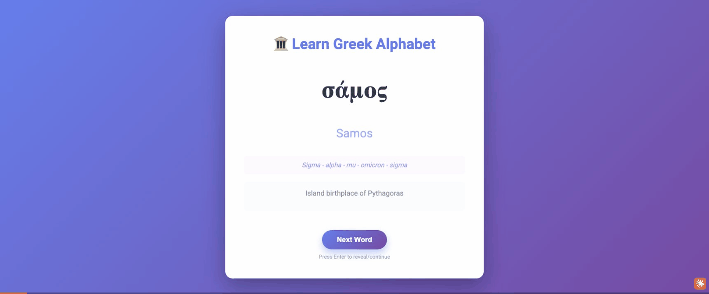

# 🏛️ It's All Greek to Me

Interactive flashcard app for learning ancient Greek vocabulary. Features 493 words including mythology, gods, cities, scientific terms, medical terminology, and philosophical concepts.



**[Try it live →](https://nadvornix.github.io/learn-greek/)**

## Features

- Flashcard-style learning with random Greek fonts
- Audio pronunciation (Modern Greek)
- Letter-by-letter spelling breakdown
- English derivatives and explanations
- Keyboard shortcuts and mobile swipe gestures

## Usage

1. View the Greek word and try to recall it
2. Press Enter/Space or click "Reveal" to see the answer
3. Navigate with arrow keys or swipe gestures

## Local Development

```bash
git clone https://github.com/nadvornix/learn-greek.git
cd learn-greek
# Open docs/index.html in your browser
```

## License

MIT License - see [LICENSE](LICENSE) file
